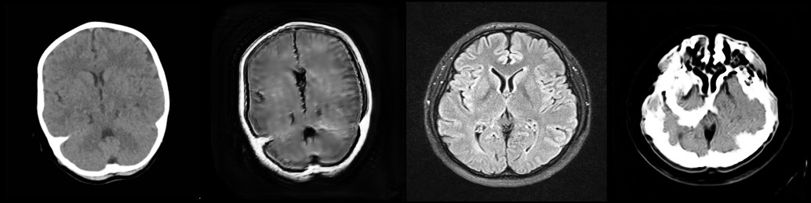
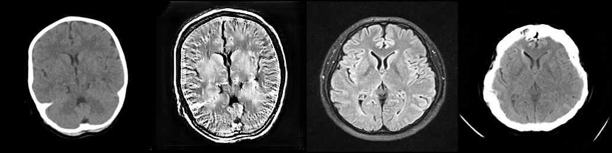

# Loss Function Analysis

The training objective for the generator is a weighted sum of five components:

$$\mathcal{L}_G = \mathcal{L}_{\text{GAN}} + \lambda_{\text{cyc}} \cdot \mathcal{L}_{\text{cycle}} + \lambda_{\text{idt}} \cdot \mathcal{L}_{\text{identity}} + \lambda_{\text{FFT}} \cdot \mathcal{L}_{\text{FFT}} + \lambda_{\text{VGG}} \cdot \mathcal{L}_{\text{perceptual}}$$

Each pulls the generator in a different direction:

| Loss | What it optimizes for | Weight |
| :--- | :--- | :---: |
| Adversarial (LSGAN) | Fool the discriminator → realistic outputs | 1.0 |
| Cycle L1 | Round-trip reconstruction `G_B2A(G_A2B(x)) ≈ x` | 10.0 |
| Identity L1 | Don't change same-domain inputs `G_B2A(A) ≈ A` | 5.0 |
| FFT frequency | Match high-frequency spectral energy | 5.0–10.0 |
| VGG perceptual | Match deep CNN feature representations | 0.3–1.0 |
| R1 gradient penalty | Regularize discriminator | 1.0 |

The weight problem in plain terms:

```
"Preserve the input" signal:   λ_cycle (10.0) + λ_identity (5.0) = 15.0
"Translate to target" signal:  λ_GAN = 1.0

Ratio: 15:1 in favor of input preservation
```

The generator was receiving 15× stronger gradient signal to reproduce the input than to transform
it. The rational optimization outcome is: make the minimal change to satisfy the adversarial loss,
then preserve everything else for the cycle and identity losses. That's exactly what happened.

---

## Individual Loss Components

### Adversarial Loss (LSGAN)

```python
def gan_loss(pred, target_is_real):
    target = torch.ones_like(pred) if target_is_real else torch.zeros_like(pred)
    return F.mse_loss(pred, target)
```

MSE (Least Squares GAN) rather than BCE because BCE gradients vanish when the discriminator is
confident. MSE provides non-zero gradients throughout training.

Healthy equilibrium: `loss_D ≈ 0.5` — discriminator is genuinely uncertain about real vs fake.
Below 0.4: discriminator is winning. Above 0.6: generator is winning.

### Cycle Consistency Loss

```python
rec_A = G_B2A(G_A2B(real_A))  # CT → MRI → CT (should ≈ original CT)
rec_B = G_A2B(G_B2A(real_B))  # MRI → CT → MRI (should ≈ original MRI)

loss_cycle_A = L1Loss(rec_A, real_A) * 10.0
loss_cycle_B = L1Loss(rec_B, real_B) * 10.0
```

The intent is to ensure translation is reversible. The consequence is that the easiest way to
guarantee perfect round-trip reconstruction is to never change the image — or hide the original
in imperceptible pixel noise and decode it on the return trip.

### Identity Loss

```python
idt_A = G_B2A(real_A)  # CT generator given CT → should return CT unchanged
idt_B = G_A2B(real_B)  # MRI generator given MRI → should return MRI unchanged

loss_idt_A = L1Loss(idt_A, real_A) * 5.0
loss_idt_B = L1Loss(idt_B, real_B) * 5.0
```

This literally trains the generator to be an identity function with weight 5.0. Combined with
cycle loss (10.0), the total "don't change the image" signal is 15.0 vs adversarial's 1.0.

### FFT Frequency Loss

**Buggy version (Phase 1-2)** — raw magnitudes:
```python
# FFT magnitudes are O(1000) — completely dominates the total loss
fake_high = torch.abs(X_fake_shifted) * high_freq_mask
real_high = torch.abs(X_real_shifted) * high_freq_mask
return F.l1_loss(fake_high, real_high)  # returns ~5-12 per image
```

**Corrected version (Phase 3-4)** — normalized power ratio:
```python
# Power ratio is O(0.001) — proportionate contribution
fake_ratio = high_freq_power_fake / total_power_fake
real_ratio = high_freq_power_real / total_power_real
excess = F.relu(fake_ratio - real_ratio)  # one-sided: only penalize artifacts, not deficit
return excess.mean()  # returns ~0.001-0.01
```

With λ_FFT=1.0, the buggy version added ~8-16 to Loss_G while total standard losses were ~2-3.
FFT was driving 80% of the gradient signal, causing severe discriminator collapse in Phase 2 Run 4:


*Phase 2 Run 4: Generator loss exploded to ~18.0 due to raw FFT magnitude scale.*

---

### VGG Perceptual Loss

**Buggy version (Phase 1-2)** — shallow layer:
```python
# relu2_2 (index 9) captures low-level edges and textures
self.features = nn.Sequential(*list(vgg.features.children())[:9])
```

**Corrected version (Phase 3-4)** — deep semantic layers:
```python
# relu4_2 (index 23) + relu3_2 (index 16) capture semantic shapes
self.features_deep = nn.Sequential(*list(vgg.features.children())[:23])
self.features_mid  = nn.Sequential(*list(vgg.features.children())[:16])
loss = 0.7 * L1(deep_fake, deep_real) + 0.3 * L1(mid_fake, mid_real)
```

Shallow VGG features are highly sensitive to pixel-level edge positions. Forcing the generator to
match these caused Gibbs ringing — high-frequency oscillations along skull boundaries (Phase 2 Run 6):


*Phase 2 Run 6: Ringing artifacts caused by relu2_2 perceptual supervision.*

Additional Phase 4 bug: VGG was applied to the *identity passes* (`idt_A`, `idt_B`) rather than
the *translated outputs* (`fake_A`, `fake_B`). The translated images received zero perceptual
guidance while the training thought they were being supervised.

### R1 Gradient Penalty

```python
grad_real = torch.autograd.grad(D(real).sum(), real, create_graph=True)[0]
r1_penalty = grad_real.pow(2).sum(dim=(1,2,3)).mean()
loss_R1 = 0.5 * r1_penalty * lambda_R1
```

R1 penalizes the discriminator for having large gradients on real images, preventing it from
becoming too confident and killing the generator's gradient signal.

Phase 2 bug: the penalty was effectively scaled 32× too strong, causing violent loss_D oscillation.
After fixing to λ_R1=1.0 in Phase 3, R1 became the single most impactful improvement — runs with
R1 held loss_D ≈ 0.48-0.50, while runs without it drifted to 0.39-0.40.

---

## Error Summary

Selected errors with most impact. Full catalog in [errors_to_remember.md](../errors_to_remember.md).

| # | Error | Runs affected | Impact |
| :---: | :--- | :--- | :--- |
| 1 | FFT loss: raw magnitudes O(1000) instead of power ratio O(0.001) | 4, 8 | Loss dominated 80% by FFT; discriminator collapse |
| 2 | R1 penalty 32× too strong | 3, 8 | Violent loss_D oscillation |
| 3 | VGG at relu2_2 instead of relu4_2 | 6 | Gibbs ringing artifacts |
| 4 | Dice/VGG applied to reconstructed rather than translated outputs | 1, 5, 6 | Zero guidance on actual translation |
| 5 | Dice uses hard boolean threshold (zero gradient) | 1, 5 | Dice loss was non-differentiable |
| 6 | Identity weight decayed too far (to 0.5) | 7 | Generator lost spatial anchor |
| 7 | ResizeConv bilinear interpolation | 2, 3, 4 | Output blurring, 5.8% SSIM penalty |
| 8 | TTUR (4× discriminator LR) in CycleGAN | 3, 7, 8 | Failed all 3 times it was tested |
| 25 | VGG applied to identity pass, not translation | Phase 3–4 | Translation had no perceptual supervision |
| 27 | Smoke test checked total loss only, not sub-components | Phase 3 | FFT bug passed undetected |
| 30 | FID covariance ill-conditioning on small val sets | Phase 4 | Unreliable FID scores early in training |

---

## Loss Interaction Effects

Losses don't just add together — they interact.

**R1 + TTUR together:** Both strengthen the discriminator. Combined, they created a double-amplification
effect — the discriminator alternated between being over-penalized (R1 step) and over-trained (4× LR).

**ResizeConv + FFT loss contradiction:** Bilinear upsampling is a low-pass filter that removes high
frequencies. FFT loss simultaneously demanded realistic high-frequency content. The generator was
being told to produce sharp details using a component that is fundamentally incapable of producing
them — this contributed significantly to Run 4's collapse.

**Cycle L1 + Identity L1 + VGG on reconstruction = triple redundancy:** All three optimize for
`output ≈ input` when applied to the same computational path. Combined weight ~16.0 vs adversarial's
1.0. The triple reinforcement of input copying was the primary driver of the translation failure.
