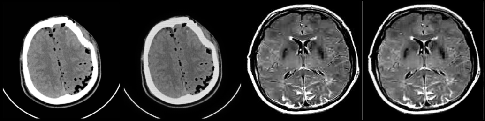
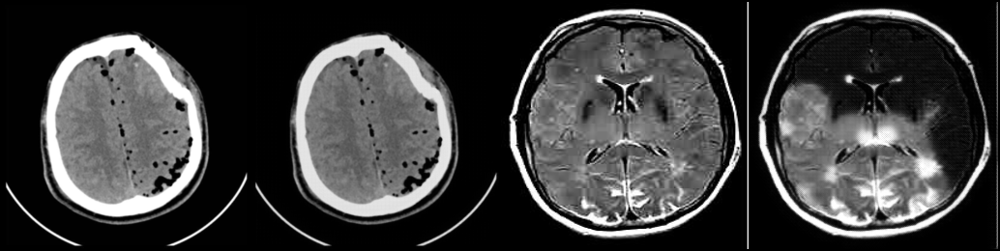
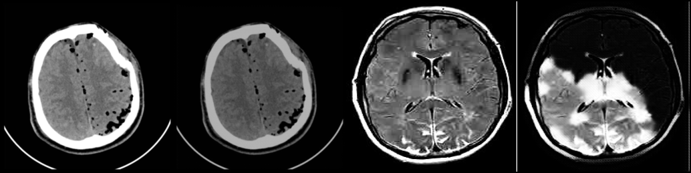
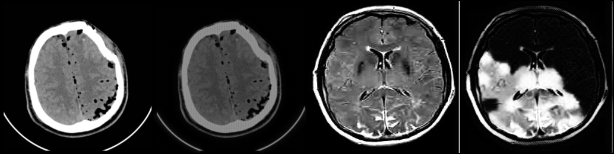

# Failure Mode Taxonomy: Why CycleGAN Replicates Instead of Translating

> This document provides visual evidence and technical analysis of the three primary failure 
> modes observed across 200 epochs of training, explaining why the model copies the input 
> rather than performing genuine cross-modality translation.

---

## 1. Understanding the Sample Images

Each saved sample image is a 4-panel grid generated by the code in 
[train_experiment_phase_4.py](../experiment_v2/train_experiment_phase_4.py) (lines 556–562):

```python
grid = make_grid(
    torch.cat([sample_ct, fake_mri, sample_mri, fake_ct], dim=0),
    nrow=4, normalize=True
)
```

```
┌──────────────┬──────────────┬──────────────┬──────────────┐
│   Panel 1    │   Panel 2    │   Panel 3    │   Panel 4    │
│   Real CT    │  "Fake MRI"  │  Real MRI    │  "Fake CT"   │
│   (Input)    │  G_A2B(CT)   │   (Input)    │  G_B2A(MRI)  │
│              │  CT → MRI    │              │  MRI → CT    │
└──────────────┴──────────────┴──────────────┴──────────────┘
```

**How to evaluate**: Panel 1 vs Panel 2 shows CT→MRI quality. Panel 3 vs Panel 4 shows MRI→CT quality. If translation is working, Panel 2 should look like a **real MRI** (not like Panel 1), and Panel 4 should look like a **real CT** (not like Panel 3).

---

## 2. Visual Evidence: Epoch-by-Epoch Analysis

### Visual Progression Across Training

#### Early Stage (Epoch 10): Initial Global Color Shift

*Panel 1: Real CT | Panel 2: Fake MRI | Panel 3: Real MRI | Panel 4: Fake CT*

#### Mid Stage (Epoch 100): Input Copying Stabilized

*Panel 2 remains an intensity-shifted CT. Panel 4 begins developing unmotivated bright spots.*

#### Final Stage (Epoch 200 - Alpha Hybrid): Copying & Mode Collapse Blobs

*Panel 2: CT skull unchanged. Panel 4: Severe bright blob artifacts in brain parenchyma.*

#### Final Stage (Epoch 200 - Beta Control): Artifact Confirmation

*Panel 4 shows even more pronounced hallucinated high-intensity cauliflower regions.*

---

### CT → "MRI" Direction (Panel 1 vs Panel 2)

**What a successful CT→MRI translation should show:**
- Panel 2 (Fake MRI) should have a **dark skull** (bone has low MRI signal due to fast T2 decay)
- Distinct gray/white matter contrast (different T1/T2 relaxation times)
- Bright CSF in ventricles and sulci (long T2 relaxation)

**What we actually observe across epochs 10–200:**
- Panel 2 retains the **bright skull rim** from the CT (bone appears bright in CT, dark in MRI)
- Internal brain contrast is nearly identical to the CT input
- No emergence of MRI-specific tissue contrast at any epoch
- The only visible change: a subtle global brightness/contrast shift

**Conclusion**: The CT→MRI generator learned to apply a **global intensity transformation** (a simple pixel-value remapping) and nothing more. This is consistent with identity loss (λ=5.0) training the generator to preserve the input.

### MRI → "CT" Direction (Panel 3 vs Panel 4)

**What a successful MRI→CT translation should show:**
- Panel 4 (Fake CT) should have a **bright skull boundary** (bone = +1000 HU)
- Relatively uniform gray soft tissue (~40 HU)
- No visible gray/white matter contrast (CT cannot resolve this)

**What we actually observe:**
- **Epochs 10–50**: Panel 4 looks like a recolored version of the MRI with some intensity changes
- **Epochs 50–100**: Bright patches begin appearing in the caudate/putamen region — not anatomically motivated
- **Epochs 150–200**: **Severe bright blob artifacts** — large bright cauliflower-like regions with no anatomical correspondence. These are the generator hallucinating "bone-like brightness" in random locations
- **Epochs 100–150**: Bright artifact patches intensify and spread
- **Epochs 150–200**: **Severe bright blob artifacts** — large bright cauliflower-like regions with no anatomical correspondence. These are the generator hallucinating "bone-like brightness" in random locations

**Conclusion**: The MRI→CT generator partially learned that CTs should have bright regions (bone) but could not determine *where* to place them. It resorted to generating bright blobs in arbitrary locations — a form of **partial mode collapse**.

---

## 3. Failure Mode 1: Identity Shortcut (Input Copying)

### Mechanism

The identity loss explicitly trains the generator to be an identity function:

```python
idt_A = G_B2A(real_A)                              # Feed CT to CT-generator
loss_idt_A = L1Loss(idt_A, real_A) * 5.0            # Force output ≈ input
```

When G_B2A receives a CT image, it learns: **output = input** (with weight 5.0). But G_B2A is the same network that processes translated MRIs. The network cannot "know" whether its input is a real CT (identity case) or a translated MRI (cycle case) — it shares all parameters.

The result: G_B2A learns a general strategy of **minimal modification** that works for both cases. When given a real CT → output ≈ input (satisfies identity loss). When given a translated MRI → output ≈ input with minor adjustments (satisfies cycle loss approximately).

### Evidence

SSIM between Real CT and "Fake MRI" (Panel 1 vs Panel 2) is extremely high:
- Phase 4, Epoch 200: Cycle SSIM_A = **0.9959**

This score means the "Fake MRI" is 99.6% structurally identical to the Real CT. If genuine translation occurred, this number would be lower (real CT and real MRI have structurally different intensities — SSIM between unrelated CT and MRI should be ~0.3–0.5).

---

## 4. Failure Mode 2: Steganographic Information Hiding

### Mechanism

Cycle consistency requires: $G_{B2A}(G_{A2B}(x)) \approx x$ with λ=10.0.

The generator discovers that the easiest way to guarantee perfect round-trip reconstruction is to **encode the original image's full pixel information** into imperceptible high-frequency noise patterns within the "translated" output.

```
Real CT ──[G_A2B]──► "Fake MRI"  (looks like CT + slight shift)
                        │
                        │  Hidden: High-frequency noise encoding of original CT
                        │
                        ▼
               ──[G_B2A]──► Reconstructed CT ≈ Real CT  (hidden info decoded)
```

The "Fake MRI" doesn't need to actually look like an MRI — it just needs to contain enough hidden information for G_B2A to reconstruct the original CT. The visible appearance can remain CT-like while the invisible noise carries the reconstruction signal.

### Evidence

- **Cycle reconstruction SSIM is near-perfect** (0.996) despite the "translated" image looking identical to the input
- **FFT ratio remains low** (0.001–0.003) — the steganographic encoding uses very high frequencies that are below the detection threshold of our FFT ratio metric
- The model achieves high SSIM and low MAE while producing visually identical images — **the metrics measure reconstruction quality, not translation quality**

### Related Literature

This phenomenon was formally described by Chu et al. (2017) in *"CycleGAN, a Master of Steganography"*, demonstrating that CycleGANs can hide information in generated images to satisfy cycle consistency without performing meaningful translation.

---

## 5. Failure Mode 3: L1 Oversmoothing (The SSIM Illusion)

### Mechanism

L1 loss minimizes pixel-wise absolute difference. When the mapping is uncertain (the generator doesn't know exactly what the target should look like), the optimal L1 strategy is to output the **expected value (mean)** of all possible valid targets:

$$\hat{y}_{L1}^* = \arg\min_{\hat{y}} \mathbb{E}_{y \sim p(y|x)} \left[ \|y - \hat{y}\|_1 \right] = \text{median}(y|x) \approx \text{mean}(y|x)$$

For image generation, this produces a **smooth, blurry average** that:
- Is pixel-close to every possible valid target → **high SSIM**
- Lacks the texture richness of any individual real target → **high FID**
- Looks "plastic" or "washed out" to human observers

### Evidence: The SSIM-FID Divergence

| Model | SSIM_A (↑ = more similar to input) | FID_A (↓ = more realistic) |
| :--- | :---: | :---: |
| Phase 4 Alpha (epoch 200) | **0.9959** | 183.71 |
| Phase 4 Beta (epoch 200) | **0.9958** | 185.74 |
| Phase 3 Run 10 (epoch 50, VGG) | 0.903 | **149.15** |

SSIM approaching 1.0 while FID remains high (>180) is the classic signature of L1 oversmoothing. The model produces pixel-perfect copies (high SSIM) that don't look like real images (high FID).

For comparison, a truly successful image translation model should achieve SSIM ~0.85 (different enough to show translation occurred) with FID < 100 (realistic enough to fool perceptual metrics).

---

## 6. Failure Mode 4: Late-Epoch Artifact Hallucination

### Mechanism

By epoch 150–200, the MRI→CT generator (G_B2A) develops **bright white blob artifacts** in the output. These appear as large, amorphous bright regions in the brain parenchyma that have no anatomical correspondence.

This is a form of **partial mode collapse**: the generator discovered that the CT discriminator's simplest feature for "real CT" is "bright regions exist" (corresponding to skull bone). Rather than learning the complex spatial pattern of bone (thin, shell-like, at the periphery), the generator learned a shortcut: **generate bright blobs anywhere**.

### Why it worsens over epochs

After epoch 100, the learning rate begins its linear decay (from the scheduled decay at epoch 100). The generator's learning signal weakens while the accumulated mode collapse bias deepens. The generator becomes increasingly committed to its bright-blob strategy as fine-tuning at lower learning rates cannot escape this local minimum.

---

## 7. Root Cause Summary

| Failure Mode | Root Cause | Weight Contribution | Observable Effect |
| :--- | :--- | :---: | :--- |
| Identity shortcut | λ_identity = 5.0 trains output ≈ input | 5.0 | Fake MRI looks like Real CT |
| Steganographic hiding | λ_cycle = 10.0 incentivizes information hiding | 10.0 | Perfect cycle reconstruction without translation |
| L1 oversmoothing | L1 loss rewards the mean/blurry prediction | 15.0 combined | SSIM ~1.0 but images look plastic |
| Artifact hallucination | Discriminator shortcut + LR decay | — | Bright blobs in Fake CT at late epochs |

**Total "preserve input" weight: 15.0**  
**Total "translate to target" weight: 1.0**  

The model is behaving rationally given its loss landscape. It is optimizing exactly what we told it to optimize — and the dominant signal (15×) says "don't change the image."
