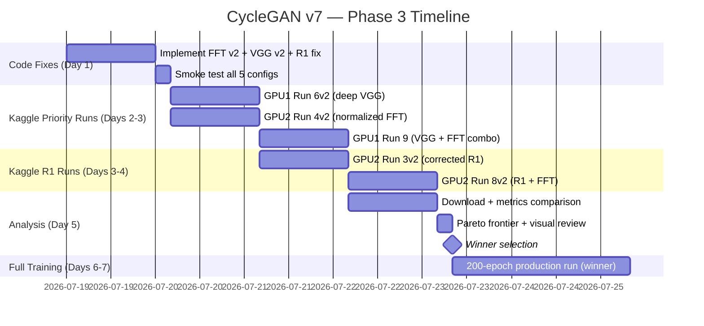

# CycleGAN MRI↔CT Retraining — Final Implementation Plan v7

> **Phase 3 plan.** This supersedes v6 and incorporates all lessons from the 9-run Phase 2 experiment. See [errors_to_remember.md](file:///e:/code/mri%20to%20cti/errors_to_remember.md) for the full error catalog, and `RECOMMENDATIONS_AND_EXPERIMENTS.pdf` for Phase 1 results.

---

## 1. What This Version Changes Over v6

| # | Change | Why |
|---|--------|-----|
| 1 | **Replaced 9-run matrix with 5-run v2 matrix** | 5 original runs had implementation bugs; 3 ideas proved fundamentally wrong |
| 2 | **All v2 runs use H_full as base** | H_full was the decisive Phase 2 winner (SSIM 0.894). No longer testing base configs. |
| 3 | **FFT loss rewritten to normalized version** | Raw FFT magnitudes inflated Loss_G by +8-16; normalized version outputs ~0.005 |
| 4 | **VGG loss moved to deeper layers + translated images** | relu2_2 caused artifact spikes; relu4_2+relu3_2 is semantic, not textural |
| 5 | **R1 penalty corrected from effective 80 → 1.0** | 32× scaling error from incorrect StyleGAN2 adaptation |
| 6 | **Dropped: TTUR, identity decay, ResizeConv, Dice, low identity** | All proved harmful or redundant in Phase 2 data |
| 7 | **Added Run 9 (VGG + FFT combo)** | Tests best-of-both if individual fixes work |

---

## 2. Phase 2 Results Summary

### The 9-Run Experiment Taught Us:

| Finding | Evidence |
|---------|---------|
| **H_full baseline is hard to beat** | Run 0: SSIM 0.894, FID 150, smooth D/G, no artifacts |
| **FFT loss was broken** (not normalized) | Runs 4, 8: Loss_G inflated to 10-18 vs normal 1-3 |
| **R1 was 32× too strong** + TTUR compounded it | Runs 3, 8: D-loss oscillated 0.5→7.0 repeatedly |
| **VGG at relu2_2 caused artifacts** | Run 6: FFT_B spiked 0.003→0.038 (exponential growth) |
| **Dice was redundant** with cycle L1 | Run 0 (no Dice) = Run 1 (with Dice) on Dice eval scores |
| **Low identity (λ=0.5) hurts anatomy** | Run 5: Idt_Dice dropped to 0.753 vs Run 0's 0.882 |
| **Identity decay causes late-epoch reversal** | Run 7: Loss_G reversed from 1.93→2.15 after epoch 33 |
| **TTUR is wrong for CycleGAN** | 3/3 TTUR runs had instability; 0/6 equal-LR runs did |
| **ResizeConv (bilinear) loses detail** | Run 2: SSIM dropped 0.894→0.842 from this swap alone |
| **Generator capacity (9 blocks) matters** | Run 1 (4 blocks): SSIM capped at 0.868 vs 0.894 |

### Runs Classification:

| Verdict | Runs |
|---------|------|
| ✅ Keep results | 0 (winner), 1 (capacity lesson) |
| ❌ Drop forever | 2 (negative control done), 5 (low idt bad), 7 (decay+TTUR bad) |
| 🔄 Redo with fixes | 3→3v2, 4→4v2, 6→6v2, 8→8v2 |
| 🆕 New | Run 9 (VGG+FFT combo) |

---

## 3. Confirmed Base Hyperparameters

Common settings across **all** v2 runs (locked):

| Parameter | Value | Notes |
|-----------|-------|-------|
| Base config | **H_full** | All runs start from the Phase 2 winner |
| Generator blocks | 9 (ResNet) | 4-block proved capacity-limited |
| Upsampling | **ConvTranspose2d** | ResizeConv confirmed inferior |
| Channels | **1 (grayscale)** | Avoids RGB color-bleeding (Error from Run 8) |
| Image resolution | 256 × 256 px | |
| λ_cycle | 5.0 (constant) | |
| λ_identity_A | **2.5 (fixed, no decay)** | Identity decay proved harmful |
| λ_identity_B | **2.5 (fixed, no decay)** | Asymmetric identity proved harmful |
| Augmentation | Flip + ±5° rotation + scale 0.9-1.1 | H_full augmentation set |
| Optimizer | Adam (β₁=0.5, β₂=0.999) | |
| LR (G and D) | **0.0001 / 0.0001 (equal)** | No TTUR — proved harmful in all 3 runs |
| Pixel normalization | [-1, 1] via mean=0.5, std=0.5 | |
| Replay buffer | 50 | |
| Dataset | 500 images per domain (local), full (Kaggle) | |
| Train/Val split | 80/20 with deterministic seed=42 | |
| Epochs | 50 | |

---

## 4. Corrected Loss Functions (v2)

### 4a. Normalized FFT Loss (Runs 4v2, 8v2, 9)

**What was wrong in Phase 2**: Raw L1 on FFT magnitudes outputted values of ~8-12, dominating all other losses.

**Corrected implementation:**

```python
def compute_fft_loss_v2(fake, real, cutoff_fraction=0.5):
    """
    Normalized FFT loss — penalizes EXCESS high-frequency energy ratio.
    Output range: approximately [0, 0.05] — compatible with other loss terms.
    """
    # Convert to grayscale if needed
    if fake.shape[1] > 1:
        fake_gray = fake.mean(dim=1, keepdim=True)
        real_gray = real.mean(dim=1, keepdim=True)
    else:
        fake_gray, real_gray = fake, real

    H, W = fake_gray.shape[-2:]

    # Power spectra (squared magnitudes — matches eval metric)
    X_fake = torch.fft.fftshift(torch.fft.fft2(fake_gray), dim=(-2, -1))
    X_real = torch.fft.fftshift(torch.fft.fft2(real_gray), dim=(-2, -1))
    power_fake = torch.abs(X_fake) ** 2
    power_real = torch.abs(X_real) ** 2

    # High-frequency mask
    y = torch.arange(H, device=fake.device) - H // 2
    x_c = torch.arange(W, device=fake.device) - W // 2
    YY, XX = torch.meshgrid(y, x_c, indexing='ij')
    r = torch.sqrt(YY**2 + XX**2)
    high_freq_mask = (r > cutoff_fraction * min(H, W) // 2).unsqueeze(0).unsqueeze(0)

    # Compute RATIO for both (normalized to [0, 1])
    fake_ratio = (power_fake * high_freq_mask).sum(dim=(-2,-1)) / \
                  power_fake.sum(dim=(-2,-1)).clamp(min=1e-8)
    real_ratio = (power_real * high_freq_mask).sum(dim=(-2,-1)) / \
                  power_real.sum(dim=(-2,-1)).clamp(min=1e-8)

    # One-sided: only penalize EXCESS high-freq (artifacts), not deficiency
    excess = F.relu(fake_ratio - real_ratio)
    return excess.mean()
```

**Key differences from v1:**
1. Uses **power ratio** (normalized [0,1]) not raw magnitudes (O(1000s))
2. **One-sided** — only penalizes excess, not deficiency
3. Output ~0.001-0.01 — compatible with other loss terms at λ_fft=5.0

---

### 4b. Deep VGG Perceptual Loss (Runs 6v2, 9)

**What was wrong in Phase 2**: relu2_2 (shallow texture layer) caused high-frequency ringing artifacts. Applied to cycle-reconstructed images (redundant with cycle L1).

**Corrected implementation:**

```python
class VGGPerceptualLossV2(nn.Module):
    def __init__(self):
        super().__init__()
        from torchvision.models import vgg16, VGG16_Weights
        vgg = vgg16(weights=VGG16_Weights.DEFAULT)
        
        # DEEP layers — semantic, not textural
        self.features_deep = nn.Sequential(*list(vgg.features.children())[:23])  # relu4_2
        self.features_mid  = nn.Sequential(*list(vgg.features.children())[:16])  # relu3_2
        
        for model in [self.features_deep, self.features_mid]:
            model.eval()
            for p in model.parameters():
                p.requires_grad = False
    
    def forward(self, fake, real):
        # Grayscale → 3ch for VGG
        if fake.shape[1] == 1:
            fake = fake.repeat(1, 3, 1, 1)
        if real.shape[1] == 1:
            real = real.repeat(1, 3, 1, 1)
        
        # ImageNet normalization
        mean = torch.tensor([0.485, 0.456, 0.406], device=fake.device).view(1, 3, 1, 1)
        std = torch.tensor([0.229, 0.224, 0.225], device=fake.device).view(1, 3, 1, 1)
        fake_norm = ((fake + 1.0) / 2.0 - mean) / std
        real_norm = ((real + 1.0) / 2.0 - mean) / std
        
        # Multi-scale: weight deeper features more (less artifact-prone)
        loss_deep = F.l1_loss(self.features_deep(fake_norm), self.features_deep(real_norm))
        loss_mid  = F.l1_loss(self.features_mid(fake_norm), self.features_mid(real_norm))
        return 0.7 * loss_deep + 0.3 * loss_mid
```

**Key differences from v1:**
1. **relu4_2 + relu3_2** instead of relu2_2 — captures shapes/semantics, not edge textures
2. **Flexible application target**:
   *   **Option B (Cycle-reconstructed)**: Computed on `rec_A`/`rec_B`. Paired, but shares representation space with cycle L1.
   *   **Option A (Identity-mapped)**: Computed on `idt_A`/`idt_B`. Paired, directly constrains translation weights, and does not overlap with cycle L1.
3. λ reduced from 0.5 → **0.3**

**Application in training loop:**
```python
# VGG Perceptual Loss (v2, semantic-only, supports Option A 'identity' and Option B 'cycle')
if cfg.get("lambda_perceptual", 0.0) > 0.0:
    if cfg.get("perceptual_mode") == "identity":
        loss_perceptual = (eval_perceptual_loss(idt_B, real_B) + 
                           eval_perceptual_loss(idt_A, real_A)) * cfg["lambda_perceptual"]
    else:
        loss_perceptual = (eval_perceptual_loss(rec_B, real_B) + 
                           eval_perceptual_loss(rec_A, real_A)) * cfg["lambda_perceptual"]
```

---

### 4c. Corrected R1 Gradient Penalty (Runs 3v2, 8v2)

**What was wrong in Phase 2**: Effective weight was 80 (should have been ~2.5). Combined with TTUR.

**Corrected implementation:**

```python
# Apply every step (not lazy), with correct scaling
if cfg.get("lambda_R1", 0.0) > 0.0:
    real_A.requires_grad = True
    real_B.requires_grad = True
    
    pred_real_A = D_A(real_A)
    pred_real_B = D_B(real_B)
    
    grads_A = torch.autograd.grad(
        outputs=pred_real_A.sum(), inputs=real_A,
        create_graph=True, retain_graph=True, only_inputs=True
    )[0]
    grads_B = torch.autograd.grad(
        outputs=pred_real_B.sum(), inputs=real_B,
        create_graph=True, retain_graph=True, only_inputs=True
    )[0]
    
    r1_penalty = (grads_A ** 2).sum(dim=(1,2,3)).mean() + \
                 (grads_B ** 2).sum(dim=(1,2,3)).mean()
    
    # Correct scaling: λ=1.0, no interval multiplier
    loss_R1 = 0.5 * r1_penalty * cfg["lambda_R1"]   # Effective weight = 0.5
    loss_R1.backward()
```

**Key differences from v1:**
1. **Every step** — not lazy/16 (simpler, more stable for CycleGAN)
2. **No × 16 multiplier** — removes the 32× scaling error
3. **λ_R1 = 1.0** — not 10.0
4. **No TTUR** — equal learning rates

---

## 5. The v2 Run Matrix (4 Redos + 1 New)

| Run | Base | New Loss(es) | λ Values | What It Tests |
|-----|------|-------------|----------|---------------|
| **0** | H_full | None | — | Control (existing results) |
| **3v2** | H_full | R1 penalty (corrected) | λ_R1=1.0 (every step, equal LR) | Does gentle R1 improve stability? |
| **4v2** | H_full | Normalized FFT | λ_fft=5.0 (power ratio, one-sided) | Does normalized FFT suppress artifacts? |
| **6v2** | H_full | Deep VGG on cycle (Option B) | λ_perceptual=0.3 (relu4_2+relu3_2) | Does cycle VGG improve visual quality? |
| **8v2** | H_full | R1 + normalized FFT | λ_R1=1.0, λ_fft=5.0 | Do R1 + FFT work together? |
| **9** | H_full | Deep VGG + normalized FFT (Cycle) | λ_perceptual=0.3, λ_fft=5.0 | Combo of Option B VGG + FFT |
| **10** | H_full | Deep VGG on identity (Option A) | λ_perceptual=0.3 (relu4_2+relu3_2) | Does identity VGG improve visual quality? |
| **11** | H_full | Deep VGG + normalized FFT (Identity) | λ_perceptual=0.3, λ_fft=5.0 | Combo of Option A VGG + FFT |

### What Was Dropped (Permanently)

| Dropped Component | Reason (one sentence) |
|-------------------|----------------------|
| Dice training loss | Threshold-based Dice was redundant with cycle L1 — Run 0 matched Dice scores without it |
| TTUR (4× D learning rate) | Failed in 3/3 runs; CycleGAN generators already have harder optimization landscape |
| Identity decay (λ→0.5) | Generator needs constant anchoring; decay caused late-epoch reversal in Run 7 |
| Asymmetric identity (λ_B=0.5) | Low identity hurt anatomy preservation — Idt_Dice dropped 0.882→0.753 |
| ResizeConv (bilinear) | Bilinear upsampling is a low-pass filter; SSIM dropped 0.894→0.842 |
| 4-block generator | Capacity-limited; SSIM capped at 0.868 vs 0.894 with 9 blocks |
| RGB (3-channel) | Caused cross-channel gradient leakage with FFT loss (Run 8 color artifacts) |

---

## 6. Metrics (Unchanged from v6)

Same 5-metric evaluation hook from Phase 2 — **already frozen and validated**:

| Metric | Type | Purpose |
|--------|------|---------|
| Cycle-reconstruction SSIM / MAE | Primary | Structural fidelity (checkpoint selection) |
| FID (both directions) | Primary | Perceptual realism |
| FFT high-frequency ratio | Safety | Artifact detection + early-stop trigger |
| Segmentation Dice (cycle + identity) | Safety | Anatomical preservation |
| Loss_D / Loss_G ratio | Safety | Training stability |

> [!IMPORTANT]
> **No changes to the eval hook.** Same frozen code, same FID reference stats from Phase 2. Direct comparison with Phase 2 results is valid.

---

## 7. Smoke Test — MANDATORY GATE (LOCAL — ~15 min GPU)

> [!IMPORTANT]
> **Do NOT proceed to Kaggle if any v2 config fails the smoke test.**

Run each of the 5 new configs for 5 epochs with `limit=50` images:

```python
SMOKE_OVERRIDES = {
    "epochs": 5,
    "limit": 50,
    "save_interval": 99,
}
```

**Additional v2 smoke checks (beyond v6's checks):**

| Check | Condition | Result |
|-------|-----------|--------|
| FFT loss v2 output range | `loss_fft > 1.0` after 5 epochs | ❌ FAIL — normalization broken |
| VGG v2 no artifact spike | `FFT_B eval > 0.02` after 5 epochs | ⚠️ WARNING — deeper layers may not be enough |
| R1 loss magnitude | `loss_R1 > 5.0` on any epoch | ❌ FAIL — scaling still wrong |
| Loss_G within normal range | `loss_G > 5.0` on any run | ❌ FAIL — some loss not normalized |

---

## 8. Execution Sequence

### Step 0: Code Changes (LOCAL — no GPU)

- [ ] Implement `compute_fft_loss_v2()` in `utils/losses.py`
- [ ] Implement `VGGPerceptualLossV2` in `utils/losses.py`
- [ ] Fix R1 penalty in `experiment_v2/train_experiment.py` (remove ×16, remove lazy, set λ=1.0)
- [ ] Update VGG application target from `rec_A/rec_B` to `fake_A/fake_B` in training loop
- [ ] Add v2 config dicts (Runs 3v2, 4v2, 6v2, 8v2, 9) to experiment runner
- [ ] **Do NOT modify the eval hook** — keep frozen from Phase 2

### Step 1: Smoke Test (LOCAL — ~15 min GPU)

- [ ] Run 5-epoch smoke test for all 5 new configs
- [ ] Verify FFT loss v2 outputs < 0.1, VGG v2 outputs < 1.0, R1 outputs < 2.0
- [ ] Verify no NaN, no OOM, no divergence

### Step 2: Priority VGG Runs (KAGGLE — ~20 hrs total, run in parallel)

To avoid 12-hour notebook session limits, runs are split into two parallel sessions on Account 1:

| Session | GPU / Account | Run | Est. Hours | Priority |
|---------|---------------|-----|:----------:|:--------:|
| **Session 1** | GPU 1 / Acct 1 | Run 6v2 (H_full + deep cycle VGG) | ~5 hrs | 🔴 Highest |
| **Session 1** | GPU 1 / Acct 1 | Run 9 (H_full + cycle VGG + FFT combo) | ~5 hrs | 🔴 Highest |
| **Session 2** | GPU 1 (Proc 2) / Acct 1 | Run 10 (H_full + deep idt VGG) | ~5 hrs | 🔴 Highest |
| **Session 2** | GPU 1 (Proc 2) / Acct 1 | Run 11 (H_full + idt VGG + FFT combo) | ~5 hrs | 🔴 Highest |

*Note: Session 1 and Session 2 will run in parallel on Account 1 (Kaggle allows up to 2 active sessions simultaneously).*

### Step 3: Mathematical Stabilization & FFT Runs (KAGGLE — ~15 hrs total)

Split into two sessions on Account 2:

| Session | GPU / Account | Run | Est. Hours | Priority |
|---------|---------------|-----|:----------:|:--------:|
| **Session 3** | GPU 2 / Acct 2 | Run 4v2 (H_full + normalized FFT) | ~5 hrs | 🟠 High |
| **Session 3** | GPU 2 / Acct 2 | Run 3v2 (H_full + corrected R1) | ~5 hrs | 🟡 Medium |
| **Session 4** | GPU 2 (Proc 2) / Acct 2 | Run 8v2 (H_full + R1 + FFT combo) | ~5 hrs | 🟡 Medium |

*Note: Session 3 and Session 4 will run in parallel on Account 2.*

### Step 4: Post-Run Analysis (LOCAL — no GPU)

- [ ] Compare all v2 runs against Run 0 baseline (existing Phase 2 results)
- [ ] **Primary comparison**: SSIM_A, SSIM_B, FID_A, FID_B at epoch 50
- [ ] **Safety check**: FFT_B trajectory (must not spike like original Run 6)
- [ ] **Stability check**: D/G loss ratio, no oscillation (must not repeat original Run 3)
- [ ] Apply Pareto frontier across v2 survivors + Run 0
- [ ] Blinded visual review on top 2-3

### Step 5: Winner Promotion to 200-Epoch Full Training

The winner gets promoted to the **200-epoch full-scale run** with:
- Full dataset (not 500-image subset)
- LR linear decay from epoch 100 to 200
- Checkpoints every 10 epochs
- All 5 metrics at every checkpoint
- FFT early-stop guard: stop if FFT_B > 0.015 for 2 consecutive checkpoints

---

## 9. Decision Flow

```
After 50-epoch v2 results:

1. Does any v2 run beat Run 0 on avg SSIM by > 0.005?
   ├── NO → Run 0 wins. Baseline is king. Proceed to 200-epoch with Run 0 config.
   └── YES → Continue to step 2.

2. Does the winning v2 run have FFT_B < 0.010 at epoch 50?
   ├── NO → Check if FFT was rising or stable.
   │   ├── Rising → Reject. Fall back to Run 0.
   │   └── Stable → Accept with FFT early-stop guard in 200-epoch run.
   └── YES → Accept. Clean win.

3. Does Run 9 (VGG+FFT) beat the individual winners (6v2 or 4v2)?
   ├── YES → Run 9 config for 200-epoch training.
   └── NO → Use the better of 6v2 / 4v2 for 200-epoch training.

4. For any R1 runs (3v2, 8v2):
   - If R1 improves stability (smoother D/G curve) without hurting SSIM → note for future use
   - If R1 doesn't help → R1 is unnecessary for CycleGAN on this dataset
```

---

## 10. Execution Timeline



**Total estimated time: ~5-7 days** (1 day code + 3 days Kaggle + 1 day analysis + 2 days full training)

---

## 11. Reference Documents

| Document | Location | Purpose |
|----------|----------|---------|
| [errors_to_remember.md](file:///e:/code/mri%20to%20cti/errors_to_remember.md) | Project root | Catalog of all 8 implementation errors from Phase 2 |
| `RECOMMENDATIONS_AND_EXPERIMENTS.pdf` | Project root | Phase 1 results and base config selection |
| Phase 2 results | `results_runs_0,4,5,6/`, `results_RUN2,3,1,8/`, `results_run7_f_asym/` | Raw outputs, train logs, sample images |

---

> **End of Plan v7** — 5 new runs (4 redos + 1 new), all using H_full as base, all with corrected loss implementations, zero TTUR, zero identity decay, zero ResizeConv. Each run tests exactly one hypothesis against the proven Run 0 baseline. Gated by smoke test, judged by the same frozen 5-metric eval hook from Phase 2.
